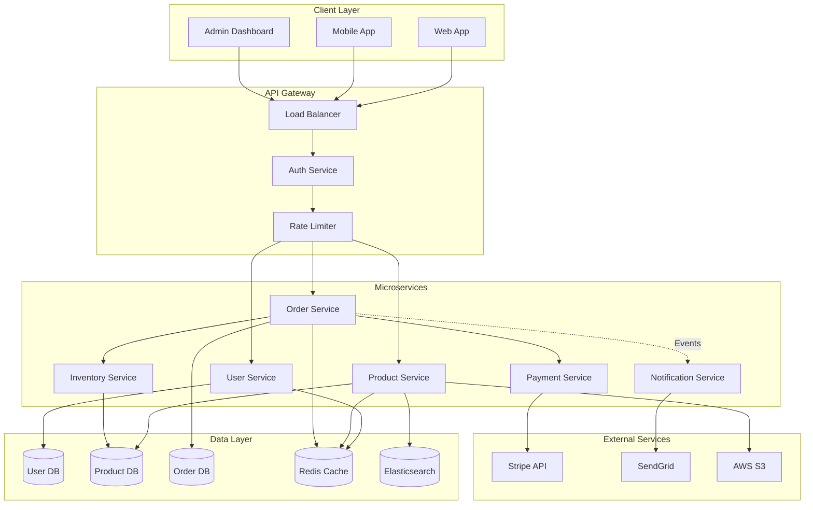
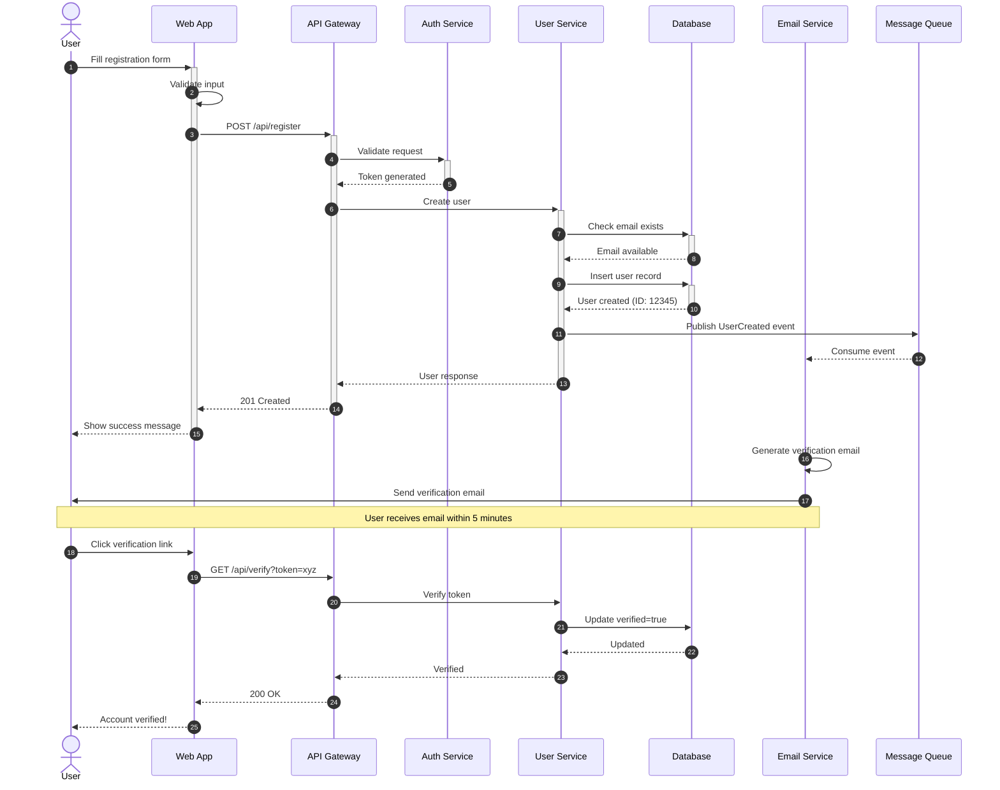
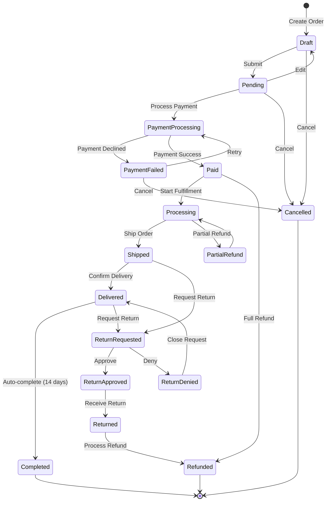
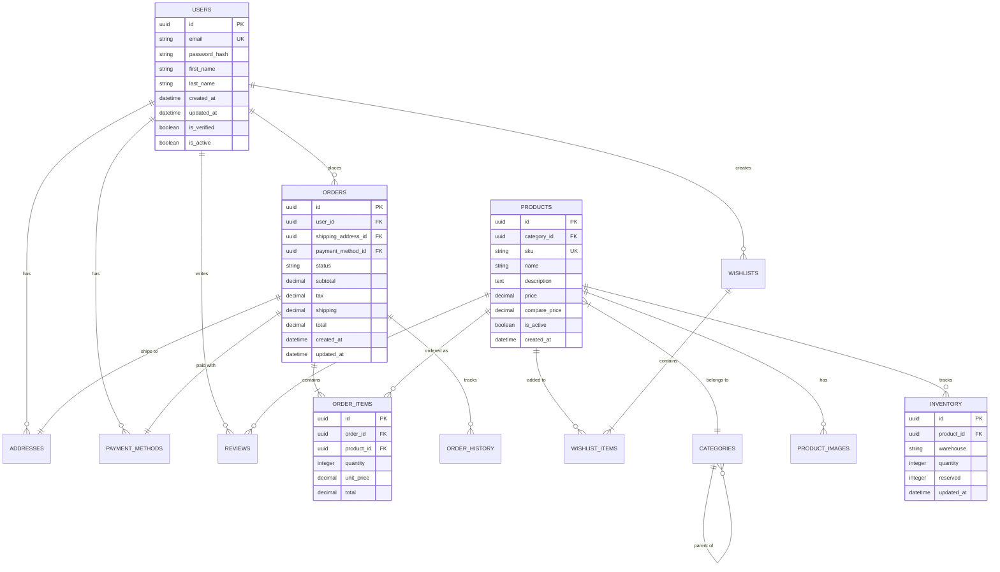
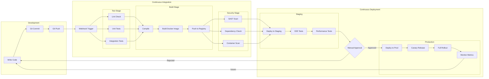
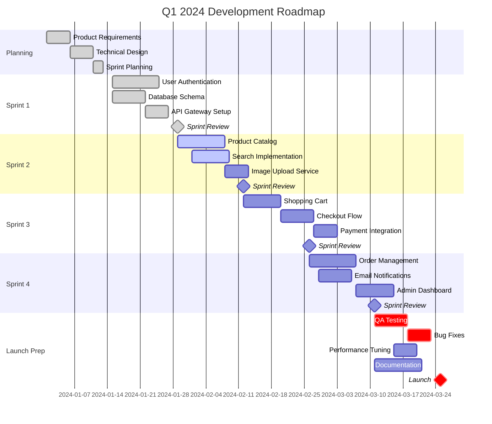
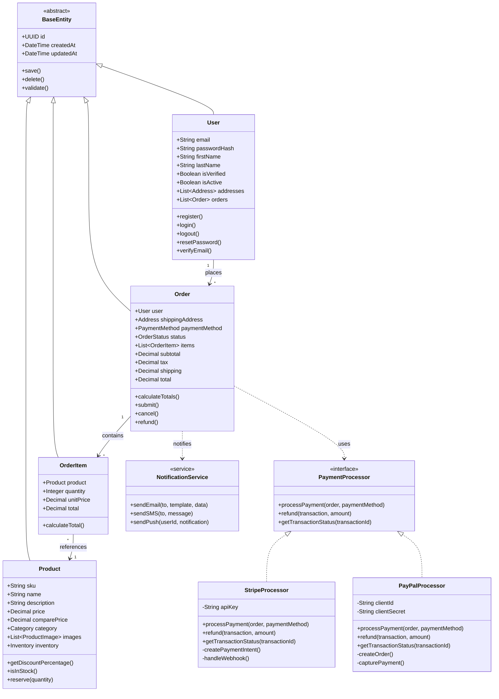
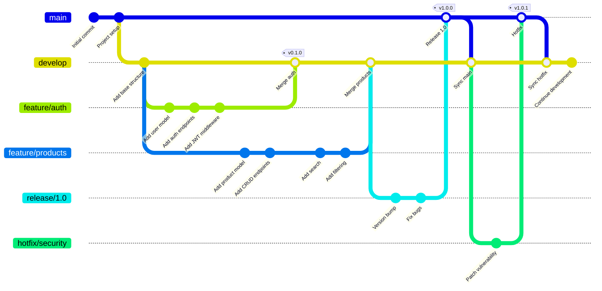
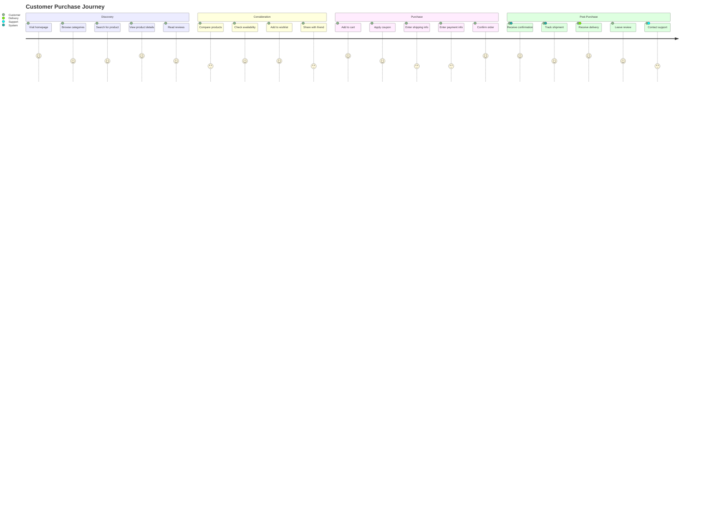

# Complex Mermaid Examples

## E-Commerce System Architecture

## User Registration Sequence

## Order State Machine

## Database Schema

## CI/CD Pipeline

## Sprint Timeline

## Class Hierarchy

## Git Workflow

## User Journey

