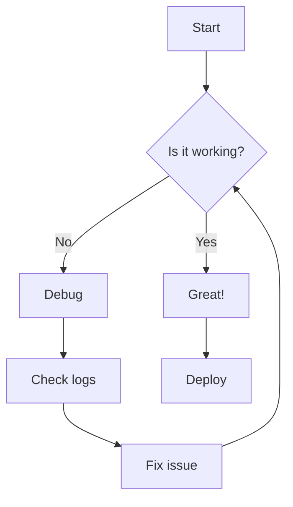
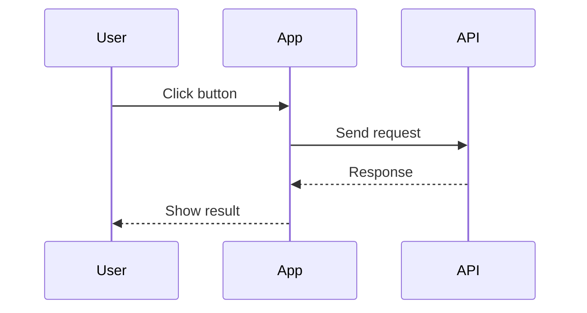
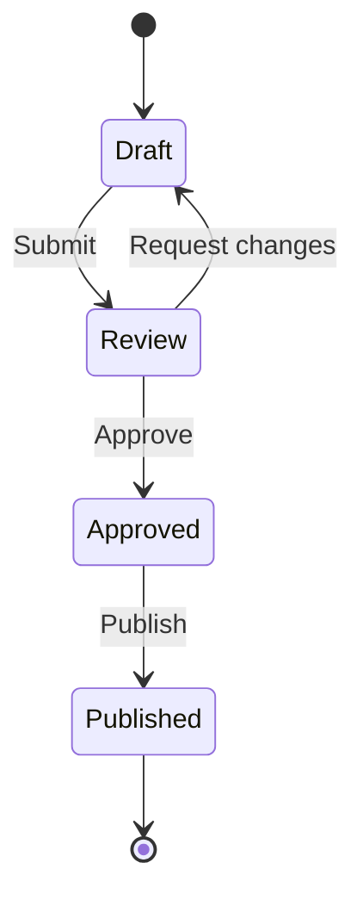
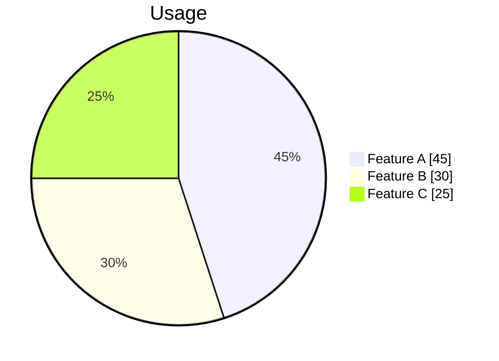
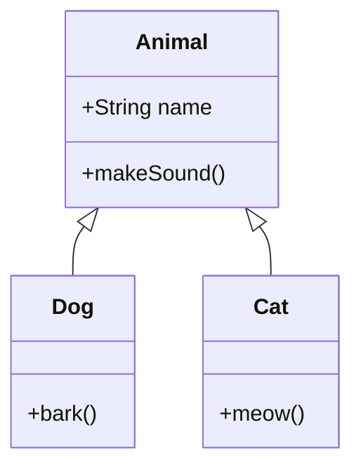

# Mermaidly Demo

Test file for the Mermaidly VS Code extension.

## Flowchart

## Sequence Diagram

## State Diagram

## Pie Chart

## Class Diagram

## Usage

- **Scroll wheel** - Zoom in/out
- **Click and drag** - Pan around
- **Double-click** - Reset view
- **Buttons** - Zoom controls
